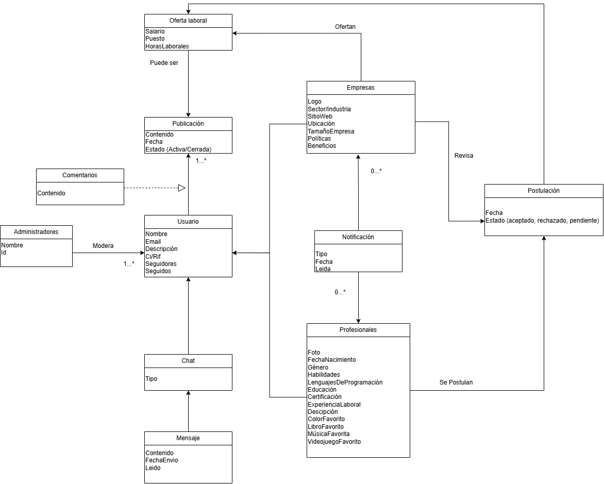
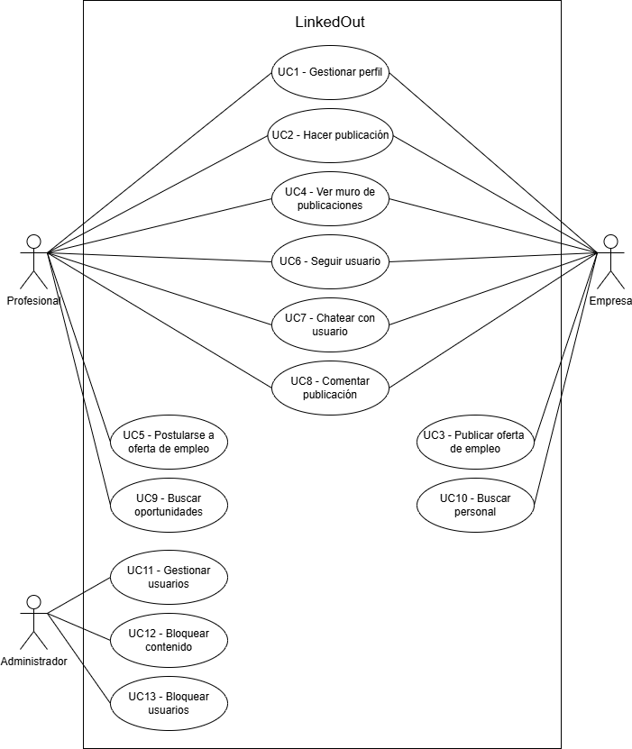
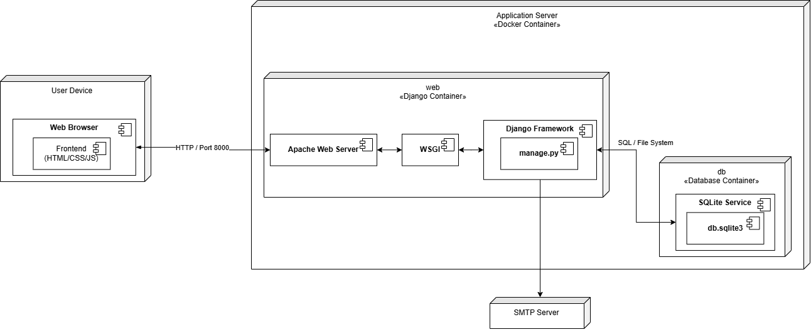
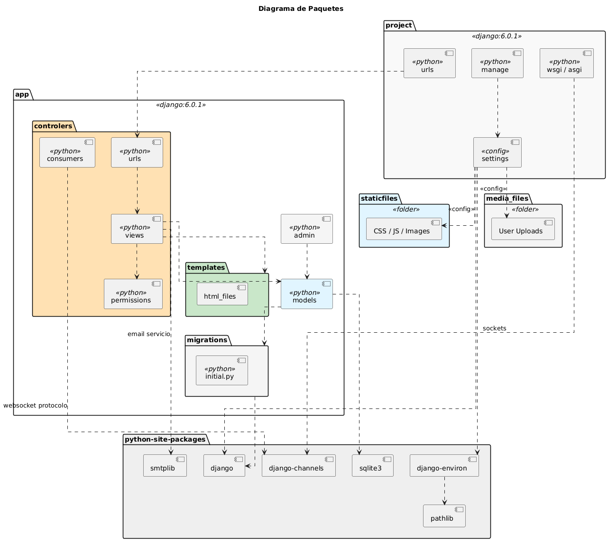
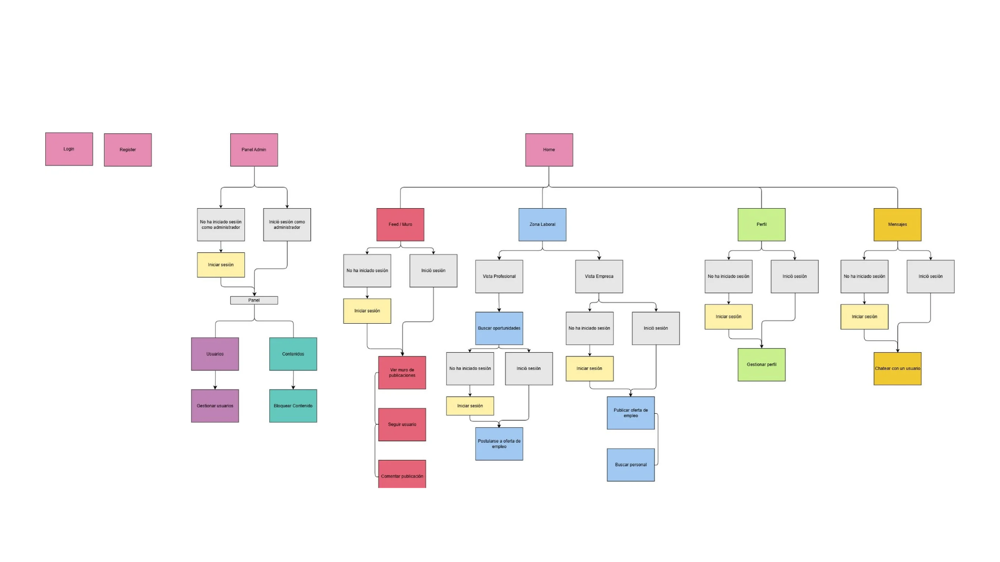
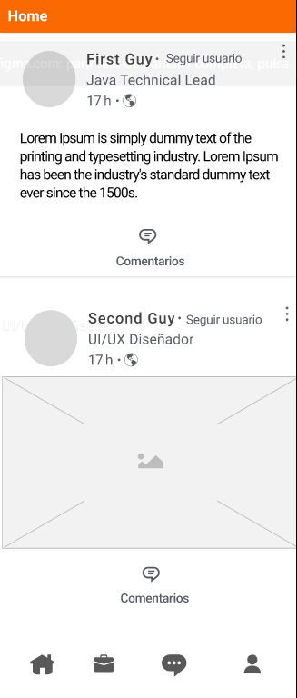
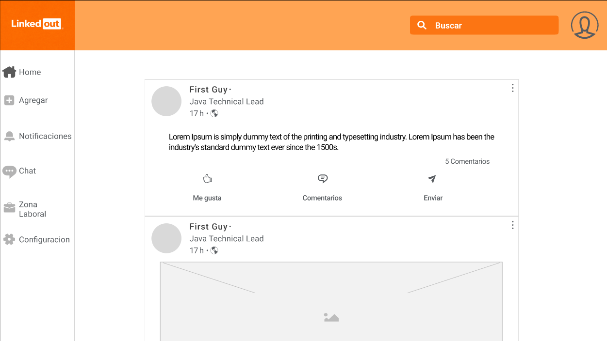

# LinkedOut

**Visión:** Red social que te conecta con el mundo empresarial.

---

## 📄 Descripción del Proyecto

LinkedOut es una plataforma diseñada para centralizar las oportunidades laborales del sector, conectando a **Profesionales** con **Empresas**.

**Más que una bolsa de trabajo:**
A diferencia de un portal de empleos tradicional, LinkedOut es una **red social completa** que fomenta la interacción profesional. Además de postularse a vacantes, la plataforma permite:

- **Socializar:** Publicar contenido en un muro y comentar publicaciones.
- **Conectar:** Seguir a otros profesionales y empresas.
- **Comunicar:** Interactuar mediante un chat privado.

### Objetivos de Negocio

- Centralizar las oportunidades laborales del sector.
- Atraer profesionales interesados en empleos.
- Impulsar la empleabilidad de la comunidad.

---

## 🏗️ Arquitectura y Diseño Técnico

El sistema se basa en el patrón **MVT (Model-View-Template)**. A continuación se presentan los artefactos que modelan la estructura y el comportamiento de LinkedOut.

### 🧩 Modelo de Dominio (DOM)

Este diagrama representa las entidades principales del sistema y cómo se relacionan entre sí (Usuarios, Perfiles, Publicaciones, Ofertas, Chat, etc.).


### ⚙️ Diagrama de Casos de Uso

Representa las interacciones entre los Actores (Profesional, Empresa, Administrador) y las funcionalidades del sistema.


### Diagrama de Despliegue

Este diagrama describe la infraestructura física y cómo se distribuyen los componentes (Docker, Django, SQLite).


### Diagrama de Paquetes

Muestra la organización lógica de los módulos del sistema (Autenticación, Perfiles, Ofertas, Chat).


### Mapa de Navegacion

Este diagrama define la experiencia del usuario (UX), mostrando el flujo entre pantallas y las condiciones de acceso (ej. áreas públicas vs. áreas privadas de usuario/admin).


## 🎨 Diseño UI (Wireframes)

[Figma](https://www.figma.com/design/InsltnGkXWAljm4XlRxcQP/Proyecto-LinkedOut-ATI?node-id=30-1057&t=hySV0PvQUuFgofog-1)

| Vista Desktop                                           | Vista Mobile                                              |
| :------------------------------------------------------ | :-------------------------------------------------------- |
|                 |                 |
| _Ver [Wireframes Mobile](./docs/Mobile_Wireframes.pdf)_ | _Ver [Wireframes Desktop](./docs/Desktop_Wireframes.pdf)_ |

---

## 🛠️ Stack Tecnológico

- **Lenguaje:** Python 3.12-slim
- **Framework:** Django 6.0.1
- **Base de Datos:** SQLite
- **Infraestructura:** Docker & Docker Compose
- **Diseño:** Figma
- **Control de Versiones:** Git

---

## 📜 Políticas de Control de Versiones

Para garantizar la estabilidad del proyecto, seguimos estas normas estrictas:

### 1. Estrategia de Ramas

- **main:** Rama de producción. Solo recibe código mediante Pull Requests (PR) aprobados.
- **Features:** `feature/UC[Numero]-[Descripcion]` (Ej: `feature/UC3-publicar-oferta`).
- **Bugs:** `fix/[Descripcion]` (Ej: `fix/error-login`).

### 2. Convención de Commits

Formato: `add/fix/update: [Descripción]`

- `add:` Para nuevas funcionalidades.
- `fix:` Para ajustes de requerimientos no funcionales.
- `update:` Para cambios en documentación.

### 3. Flujo de Integración (CI/CD)

- **Pipeline:** Cada _push_ dispara un pipeline en GitHub Actions que valida la estructura de Django y el build de Docker.
- **Merge:** Es obligatorio que el pipeline esté en **verde** y el PR sea revisado antes de unir a `main`.

---

## 🚀 Cómo iniciar el proyecto

El proyecto está contenerizado para garantizar que funcione correctamente en cualquier equipo.

1.  **Clonar el repositorio:**

    ```bash
    git clone https://github.com/Samantha-Ramirez/Proyecto2ATI.git
    ```

2.  **Iniciar la aplicación:**
    Ejecuta el siguiente comando en la terminal (donde está el archivo `docker-compose.yml`):

    ```bash
    docker compose up --build
    ```

3.  **Acceder:**
    Abre tu navegador en: [http://localhost:8000](http://localhost:8000)

4.  **Detener la aplicación:**
    Ejecuta el siguiente comando en la terminal (donde está el archivo `docker-compose.yml`):

    ```bash
    docker compose down -v --rmi all
    ```

---

## 👥 Equipo de Desarrollo (Dev Team)

Proyecto realizado para la asignatura "Aplicaciones con Tecnología Internet" (Semestre 2025-2, UCV).

**Stakeholders:**

- **Maria Herrero** - CEO
- **Sofía Marcano** - Product Owner

**Developers:**

- **Samantha Ramírez** - Scrum Master
- **Gustavo Berne** - UI/UX Developer
- **Luisdavid Colina** - Developer
- **José Campos** - Developer
- **Gabriel Padilla** - Developer

---
